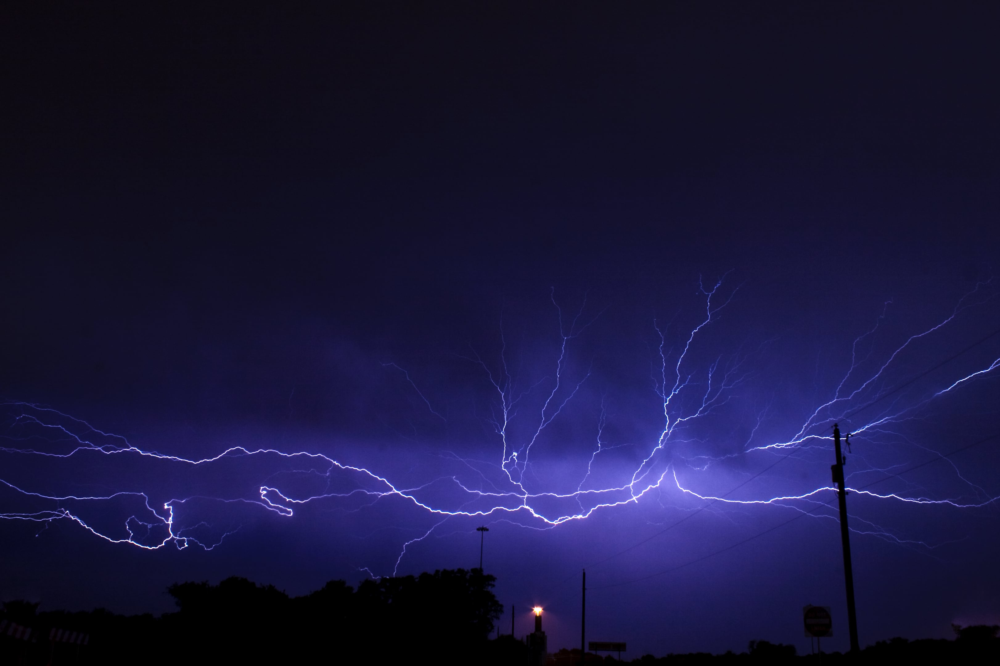

> An impressive display of spider lightning stretches across the sky over Grand Prairie, TX.

This is an older image that I captured way back on June 12, 2009 as severe thunderstorms moved through the D/FW Metroplex from the west. According to [this lightning entry on Wikipedia](https://en.wikipedia.org/wiki/Lightning), spider lightning is an observational variation of anvil crawler lightning and "is created when leaders propagate through horizontally-extensive charge regions in mature thunderstorms. These discharges usually begin as intracloud discharges originating within the convective region; the negative leader end then propagates well into the aforementioned charge regions in the stratiform area. If the leader becomes too long, it may separate into multiple bidirectional leaders. When this happens, the positive end of the separated leader may strike the ground as a positive CG flash or crawl on the underside of the cloud, creating a spectacular display of lightning crawling across the sky." The most impressive anvil crawler display that I have ever witnessed was in the year 2001, during the late spring, over the D/FW Metroplex. That display was unlike anything that I had ever witnessed before and lasted for several hours on the trailing edge of a complex of tornadic thunderstorms that rumbled across the area.

**GEAR**
- Canon EOS Digital Rebel XTi 10.1MP DSLR (crop sensor)
- Canon EF-S 18-55mm f/3.5-5.6 IS lens @18mm
- Manfrotto tripod and ballhead

**SETTINGS**
- Aperture: f/11
- ISO 100
- Shutter speed: 1 second

Digital image development and post-processing was done using older versions of Adobe Lightroom and Photoshop.

While the results can be quite stunning, photographing lightning can be very dangerous if proper precautions are not taken. The image shown here was captured from within the safety of a vehicle. This can pose some challenges due to light reflections from the windshield, but this can be easily overcome with the use of a circular polarizing filter attached to the front of your lens. Shooting outside the vehicle should be done with extreme caution, with careful attention paid to ensuring that you are not the tallest object around, as lightning can and will strike anywhere in and around a thunderstorm with no advance warning. In fact, it is not unheard of for lightning strikes to be observed 30 miles or more away from the actual thunderstorm itself.

As for camera settings, those shown above are a good starting point however, as I have learned more about capturing sharp images over the years, I now prefer to set my lens to an aperture of f/8 and utilize an intervalometer in order to capture a series of images in succession without the need to continuously manually trigger the shutter release on the camera. Regarding the ISO setting and shutter speed, my best advice is to play around with different values to find what works best for you. Generally, the lower the ISO, the less noise you will have in your images and, when shooting lightning, shutter speeds of 1 second or greater while allow you to potentially capture multiple lightning strikes in one frame. When using a digital SLR, try not to exceed a shutter speed of 4 minutes at the very longest (this value is based on my own observations with the equipment I have used. Your mileage may vary.), or you will begin to introduce sensor noise into your image from overheating.

Next time thunderstorms form in your area be sure to keep an eye to the sky for the possibility of awe-inspiring lightning events.

Thanks for visiting and have fun on your own photo adventures!